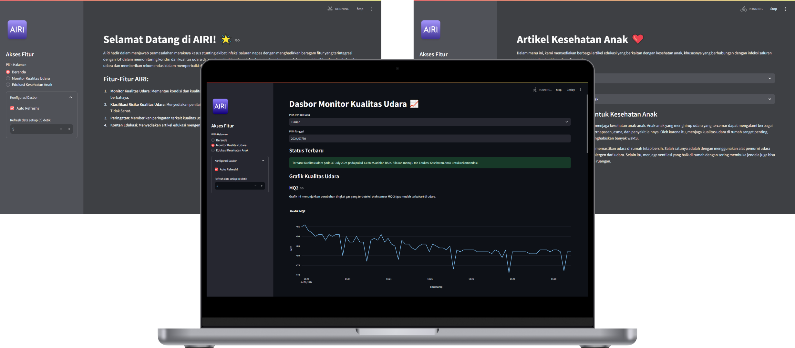

# Samsung Innovation Campus Batch 5 (SIC5)

## Member of Group 6

1. [Bayu Siddhi Mukti](https://github.com/bayu-siddhi)
2. [I Putu Adhitya Pratama Mangku Purnama](https://github.com/portodit)
3. [Hilmi Gema Hidayatullah](https://github.com/HilmiGH)

## AIRI - Home Air Quality Monitoring & Classification

The final project of the Samsung Innovation Campus Batch 5 (SIC) program to create AIoT (AI & IoT) tools in the field of ***Health***.

AIRI is an innovative platform that provides an easy and fast home air quality monitoring and classification system using IoT and AI technology.

1. `Air Quality Monitoring` This feature makes it easier for users to monitor indoor air conditions and quality, such as humidity, temperature, and the presence of certain gases, through an interactive dashboard that is directly connected to IoT devices.
2. `Air Quality Classification` This feature uses machine learning to analyze air quality data from IoT devices. The analysis results provide real-time air risk alerts to the categories *good*, *moderate*, or *unhealthy*.
3. `Health Articles` This feature provides information about children and family health, especially related to respiratory diseases, as well as tips for improving air quality in the home.

## Technologies
* Hardware for the IoT device
  * ESP32
  * MQ-2
  * MQ-135
  * DHT11
* Software for development
  * C++
  * Python
    * scikit-learn (for Machine Learning model)
    * paho-mqtt (for MQTT client)
    * streamlit (for dashboard)
  * MySQL

> Python library details are in [requirements.txt](requirements.txt)
